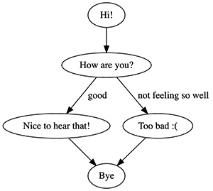

## VoiceMachine, a state machine for voice

VoiceMachine is an advanced state machine for building applications for Google Assistant.

Currently VoiceMachine supports `actions-on-google` but it might be expanded in later releases if there's interest.

## Changelog

### 0.7

- Added SoundManager, a helper to construct responses consisting of multiple audio files.

### 0.6

- Added a Visualizer

### 0.6.4

- Added `setStartState` which you can specify in your flow definition.

## Installation

```
yarn add actions-on-google
yarn add voicemachine
```

`actions-on-google` is a peerDependency, so make sure to install it yourself!

## Setup

```js
// Require the actions-on-google connector
const { actionsdk } = require("actions-on-google");
const { VoiceMachineForActionsSDK } = require("voicemachine");

// Write your machine
const flow = machine => {
    machine.register("intro", ({ machine, conv, input }) => {
        conv.ask("This is a simple demonstration. Say anything to continue");

        return {
            next: "step_2"
        };
    });

    machine.register("step_2", ({ machine, conv, input }) => {
        conv.ask("Ok, anything else?");

        return {
            next: "bye"
        };
    });

    machine.register("bye", ({ machine, conv, input }) => {
        conv.end("Bye!");
    });

    // OPTIONAL: set start state. Usefull for debugging
    machine.setStartState("intro");

});

// register it with the sdk
const app = actionssdk({ debug: false });
VoiceMachineForActionsSDK(app, flow, { debug: true });

// register it with whatever framework you're using (for example: Serverless + Express)
module.exports = express().use("/webhook", bodyParser.json(), app);
```

Don't forget to register your action with the [gactions CLI](https://developers.google.com/assistant/tools/gactions-cli).

Alternatively you can create your own integration by instantiating the VoiceMachine yourself:

```js
const machine = new VoiceMachine(flow, options);
await machine.run(conv);
```

# Explanation

A statemachine is a series of steps, and your program can only be in one state at a time. You create a VoiceMachine state machine by registering all your states in a setup function (see `flow => (machine) { ... }` in "Setup").

A step is registered by calling: `machine.register(name, action, options)` with name being a unique string, action being a function and an optional options object.

Each registered step's action is passed an object with these dependencies when called:

- `machine`: the state machine itself.
- `input`: the voice input, lowercased for easier matching against expressions
- `rawInput`: the voice input
- `conv`: the `actions-on-google` conversation object

The options object can contain these keys for now:

```js
{
    visualizer: {
        input: ["yes", "no"],
        label: "A nice label for the GraphViz node"
    }
}
```

Input are all input strings that are tried in order to draw a graph (see [Visualizer](#Visualizer)).

Each state must return an object with these keys

- `next`: the state to run after this one (**required** for every step except the last one)
- `skipListen`: makes the machine autorun the next step, without listening for user input (if you don't output anything this will also happen) **optional**
- output: an object literal for quickly displaying a card. It's recommended to use the `conv` object to output speech. **optional**
  - title
  - text
  - image
  - audio ({ src, text })
  - suggestions

## Persisting data

VoiceMachine also contains a mechanism to store values. These values get resent from the client to the server on every request, so it's advised to keep things small.

**Usage:** `machine.memory.numberToBeGuessed = Math.round(Math.random()*10)`

To pass data between different states in the same request (when you're not outputting anything, or you use `skipListen`) you can use the `machine.cache` object to store things.

**Usage:** `machine.cache.askAgain = true`

## Visualizer

Since version 0.6 it's possible to output a .dot file, which you can feed to GraphViz in order to create a neat visualization. Use this code to do so:

```js
const { VoiceMachineForActionsSDK, Visualizer } = require("voicemachine");
const flow = (machine) => {
    // create your flow
}
const V = new Visualizer(flow);
V.createDotFile("./graph.dot").then(() => console.log("done"));
```

If you are branching somewhere based on input (e.g. yes/no) you can supply the different possible inputs in the options object of the state:

```js
{
    visualizer: {
        input: ["yes", "no"],
        label: "A nice label for the GraphViz node"
    }
}
```

This will give you a .dot file which you can [convert](https://dreampuf.github.io/GraphvizOnline/) to a nice graph:



## SoundManager

SoundManager allows you to construct responses containing multiple audio files. For example, if you have three clips:

- "The answer is carrot cake" - carrotcake.ogg
- "You answered correctly. You get 10 points" - correct.ogg
- "Your answer was incorrect." - incorrect.ogg

You can do as follows:

```js
const { SoundManager } = require("voicemachine");

const SM = new SoundManager("https://your-cdn.com/");

const flow = machine => {
  machine.register("ask", ({ conv }) => {
    SM.addSound("question.ogg", "What's the best cake in the world?");
    SM.flush(conv);
    return {
      next: "check_answer"
    };
  });

  machine.register("check_answer", ({ conv, input }) => {
    SM.addSound("carrorcake.ogg", "The answer is carrot cake.");
    SM.addPause(100);
    if (input.toLowerCase() === "carrot caker") {
      SM.addSound("correct.ogg", "You answered correctly. You get 10 points.");
    } else {
      SM.addSound("incorrect.ogg", "Your answer was incorrect.");
    }

    SM.flush(conv, true);
    return {};
  });
};

module.exports = flow;
```

### SoundManager API

| Method  
| -------------------------------| -------------------------------------------------------------------------------------------------------------------- |
| `constructor(url)` | Pass the base URL (where your sounds are) |
| `addSound(soundFile, alt)` | Add a sound to the playback queue. Alt text is a fallback (and is also displayed on screen) |
| `addPause(ms=500)` | Add a pause to the playback queue (default: 500ms) |
| `flush(conv, end=false)` | Plays back the queue. If you pass end=true the conversation is closed |
|

## Todo

- [ ] Integration adapters for Redis, ... (memory)
- [ ] Integrate with other services like Alexa
- [x] Explore xstate and its fancy diagrams
- [ ] Add examples

This project is bound to change a lot. Make sure to pin a version if you use it.
